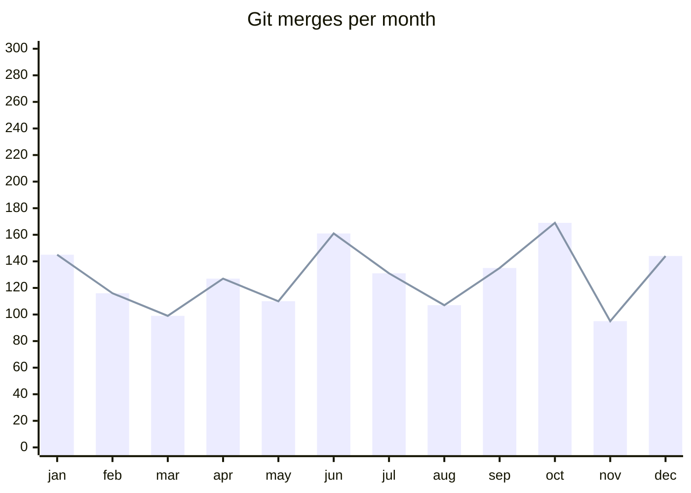

```mermaid
%%{init: {"gantt": {"diagramPadding": 150}}}%%
gantt
    title Git merges per month
    dateFormat  X
    axisFormat %s

    section Jan
    145   : 0, 145
    section Feb
    116   : 0, 116
    section Mar
    34   : 0, 34
    section Apr
    9    : 0, 9
    section May
    5    : 0, 5
    section Jun
    71   : 0, 71
    section Jul
    36   : 0, 36
    section Aug
    34   : 0, 34
    section Sep
    71   : 0, 71
    section Oct
    36   : 0, 36
    section Nov
    34   : 0, 34
    section Dec
    36   : 0, 36
```

```mermaid
xychart-beta
    title "Git merges per month"
    x-axis [jan, feb, mar, apr, may, jun, jul, aug, sep, oct, nov, dec]
    y-axis 0 --> 300
    bar [145, 116, 99, 127, 110, 161, 131 , 107, 135, 169, 95, 144]
    line [145, 116, 99, 127, 110, 161, 131 , 107, 135, 169, 95, 144]
```
